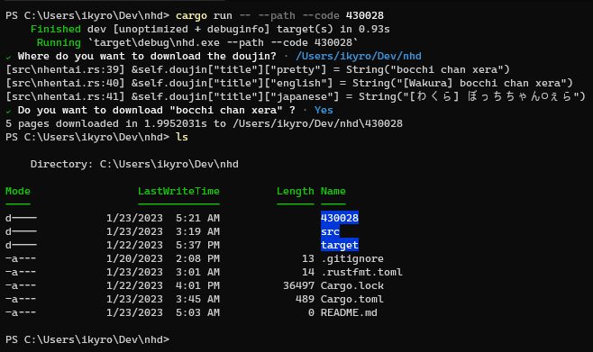

# Cross plataform doujin downloader

how bypass cloudflare protection on  [wiki](https://github.com/ikyro/nhd/wiki)

# Usage

By default the program will download the doujin in to `~/.nhentai`

```sh
nhd --code 430028
```

add `--path` to ask for a path to download the doujin

```sh
nhd --path --code 430028
```

## `Cross plataform`

If you want download doujin on current directory pass `.`

## `Windows`

For `Windows` path to be specified as `Unix` style


